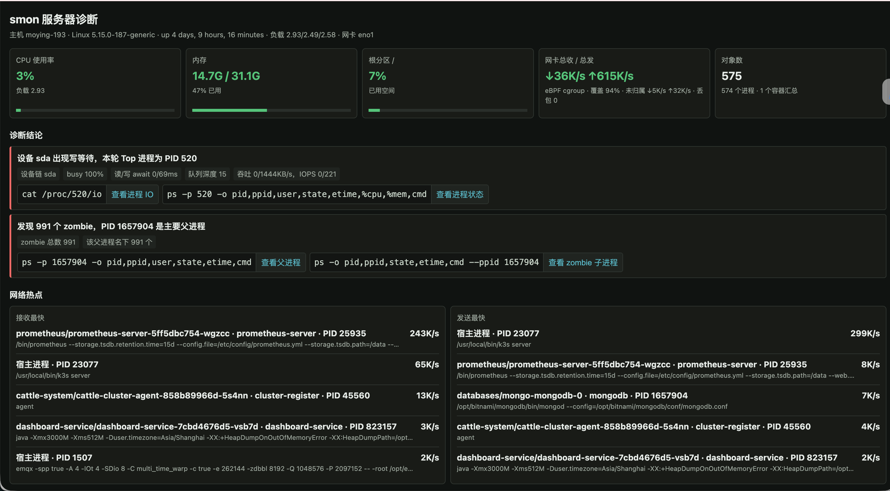
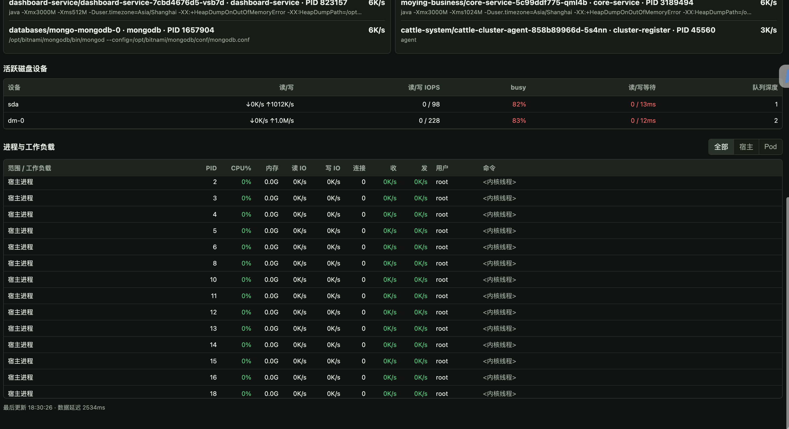

# smon

[](LICENSE)
[]()
[]()
[]()
[](https://github.com/dongdonglog/fast-bash/releases/latest)
[](https://github.com/dongdonglog/fast-bash/releases)

> 一条命令看到 CPU、内存、磁盘 IO、网卡流量，以及**宿主机进程 + Kubernetes Pod + Docker/Podman 容器** 的 TCP/UDP 收发速率和定位到 PID 的归属结论。

`smon` 是一个面向 Linux 服务器的实时排障工具，专为回答这些问题而设计：

- *这个口子到底是谁打的？落到哪个 Pod？*
- *CPU/内存没炸，但磁盘 IO 在抖，是哪条容器写爆了？*
- *网卡流量起来了，宿主进程、Kubernetes Pod 和独立容器各自的贡献是多少？*
- *内存里 991 个僵尸进程，源头是哪个父进程？*

**采集器** 用 Go 写的 `smon-net`（嵌 eBPF cgroup + `AF_PACKET/TPACKET_V3`，MIT），**呈现层** 用 Bash TUI 和纯 Python 3 标准库的 HTTP 面板；不需要 Node、不需要 React、不需要 Go runtime。Linux amd64 / arm64 静态发行包。

---

## 截图

<details open>
<summary><b>Web 面板 · 诊断、网络热点、磁盘设备、进程负载</b></summary>


</details>

<details>
<summary><b>Web 面板 · 进程与工作负载列表（全部 / 宿主 / Pod / 容器筛选）</b></summary>


</details>

---

## 目录

- [特性](#特性)
- [快速开始](#快速开始)
- [使用](#使用)
- [Web 面板](#web-面板)
- [原理](#原理)
- [JSON 接口](#json-接口)
- [内部采集接口](#内部采集接口)
- [平台与限制](#平台与限制)
- [开发与测试](#开发与测试)
- [项目结构](#项目结构)
- [贡献](#贡献)
- [许可](#许可)
- [致谢](#致谢)

---

## 特性

- **eBPF cgroup + AF_PACKET/TPACKET_V3** 双抓包，归属到 cgroup，再回查 `/proc` 解析出唯一 PID 或 Pod/容器；权限失败自动降级到 `ss -i`，不会把"采不到"解释成 0。
- **磁盘块设备** 实时吞吐、IOPS、busy %、读写 await、队列深度；不依赖 `iostat`。
- **结构化诊断结论** — 责任 PID/Pod、证据、磁盘根因和可复制的只读排查命令；点按钮只复制，不在服务器自动执行。
- **三层呈现** — Bash TUI、JSON (`-j`)、Web 面板，三者消费同一份版本化的原子 TSV 快照。
- **IPv4 / IPv6 / VLAN / QinQ** 全覆盖，unknown 分类（未匹配、shared socket、已退出、非 TCP/UDP）透明可见。
- **静态离线发行包** — runtime 不需要 Go / Node / NetHogs / libpcap / ncurses；只依赖系统自带的 Python 3。
- **主流 CRI/runtime** — 通过本机 CRI v1 统一支持 containerd、CRI-O、cri-dockerd，并识别 Docker、Podman/libpod 的 systemd 与 cgroupfs 布局；不需要 Kubernetes API 凭据，也不调用运行时命令。

---

## 快速开始

完整模式需要 `root`（或具备 `CAP_BPF + CAP_NET_RAW` 权限）：

```bash
# 1. 在线安装最新版 Release（自动识别 amd64 / arm64，校验 SHA-256）
curl -fsSL https://github.com/dongdonglog/fast-bash/releases/latest/download/install.sh | sudo bash

# 2. 打开交互式 TUI
sudo smon

# 3. 一键 Web 面板
sudo smon --serve 8080
# 浏览器打开 http://<服务器IP>:8080/
```

> 一条命令离开前先确认本机能连通 [GitHub Releases](https://github.com/dongdonglog/fast-bash/releases)；断网/受限环境请使用下面的[离线安装](#离线安装)。

### 在线安装

```bash
curl -fsSL https://github.com/dongdonglog/fast-bash/releases/latest/download/install.sh | sudo bash
```

直接下载离线包：

```bash
# Linux x86_64 / amd64
curl -fLO https://github.com/dongdonglog/fast-bash/releases/latest/download/smon-linux-amd64.tar.gz
curl -fLO https://github.com/dongdonglog/fast-bash/releases/latest/download/smon-linux-amd64.tar.gz.sha256

# Linux ARM64
curl -fLO https://github.com/dongdonglog/fast-bash/releases/latest/download/smon-linux-arm64.tar.gz
curl -fLO https://github.com/dongdonglog/fast-bash/releases/latest/download/smon-linux-arm64.tar.gz.sha256
```

内网可指向镜像：

```bash
curl -fsSL http://mirror.example/smon/install.sh |
  sudo SMON_BASE_URL=http://mirror.example/smon/releases bash
```

### 离线安装

```bash
# 1. 在同架构的联网机器上下载
#    smon-linux-amd64.tar.gz (含 .sha256) 或 smon-linux-arm64.tar.gz
# 2. 拷贝到目标机后执行
sha256sum -c smon-linux-<arch>.tar.gz.sha256
tar -xzf smon-linux-<arch>.tar.gz
cd smon-linux-<arch>
sudo ./install.sh
```

资产齐全时 `install.sh` **不发起任何网络请求**；默认安装到 `/usr/local/bin/`，许可证和第三方声明到 `/usr/local/share/doc/smon/`。

### 源码运行（macOS 也能跑）

```bash
# macOS：自动降级到 CPU / 内存视图
bash smon.sh

# Linux：在仓库根目录构建匹配的采集器
CGO_ENABLED=0 GOOS=linux GOARCH=amd64 go build -o smon-net ./cmd/smon-net
sudo ./smon.sh
```

Go 只用于构建，不是发布包的运行时依赖。

---

## 使用

```text
smon                # 实时进程表，默认每 5 秒刷新
smon -m             # 按内存排序
smon -d             # 按磁盘 IO 排序
smon -n             # 按进程网络收发排序
smon -i 1           # 1 秒刷新
smon -j             # 一次 JSON 采样（默认约 1 秒）
smon --serve        # 启动 Web 面板，默认端口 8080
smon --serve 9000   # 指定端口
```

TUI 快捷键：

| 键 | 作用 |
|----|------|
| `c` | 按 CPU 排序 |
| `m` | 按内存排序 |
| `d` | 按磁盘 IO 排序 |
| `n` | 按网络收发排序 |
| `q` | 退出 |

默认抓主路由网卡，可显式覆盖：

```bash
sudo SMON_NETIF=eno1 smon -n
sudo SMON_NETIF=eno1 smon --serve 8080
```

非 root / 采集器缺失 / 异常时会**自动降级**到 `ss -i`，TUI / JSON / Web 同步显示降级原因，绝不把漏采解释成准确的 0。

---

## Web 面板

`sudo smon --serve 8080`，打开 `http://<服务器IP>:8080/`。

面板包含：

- **顶部指标卡** — CPU、内存、根分区、网卡总 RX/TX、对象数（含对象/Zombie 计数）。
- **诊断结论** — 责任 PID/Pod、证据、根因、可复制的只读排查命令（一键复制）。
- **网络热点** — 接收/发送最快的 5 个宿主进程或容器工作负载，以及顶层块设备指标；支持 `全部 / 宿主 / Pod / 容器` 筛选；无有效网络流量时整区隐藏。
- **活跃磁盘设备** — `sda / dm-0` 等设备的读写吞吐、IOPS、busy、读写 await、队列深度。
- **进程与工作负载** — 全量进程列表，附归属类型（socket / cgroup / 已退出 / unknown）。

Python 后端长期运行一个 `smon-net` 实例、每秒更新一次内存缓存；**采集器崩溃自动重启**，恢复前所有接口会显示降级原因。

实现细节：

- 复制按钮在普通 HTTP 内网场景走兼容模式，不依赖 HTTPS Clipboard API；浏览器完全禁止自动复制时会显示带完整命令的手动复制框。
- 进程命令、用户名、告警、错误文本在插入 HTML 前 **统一转义**。
- 诊断结论的"查看父进程""查看进程 IO"等按钮只复制命令，不会在服务器上自动执行。

---

## 原理

`smon-net` 是一个独立的 MIT 代码，使用了与 NetHogs 同类的公开 Linux 接口，但**没有复制任何 GPLv2+ 源码**（见 `THIRD_PARTY_NOTICES`）。

数据流：

1. 嵌入的 **cgroup-skb eBPF 程序** 按 cgroup ID、IPv4/IPv6、TCP/UDP tuple 和方向累计字节。
2. `AF_PACKET/TPACKET_V3` 同时给出选定网卡的总量、报文数和 drop；eBPF 加载失败自动回退。
   eBPF 流量 map 在高并发更新时可能出现 `iteration aborted`（遍历期间条目被新增或淘汰）；采集器会自动重试，仍未完成时保留已读归属并标记本轮 `partial`，不会因此丢掉 Pod/容器维度或直接降级。
3. 扫描所有进程的 **cgroup、network namespace、socket fd** 与对应的 `/proc/<pid>/net/*`，把唯一 socket owner 关联回 PID。
4. 只读探测本机 CRI v1 socket，缓存 containerd、CRI-O、cri-dockerd 的容器与 Pod metadata；同时解析 `cri-containerd-*`、`crio-*`、`docker-*`、`libpod-*`、cgroupfs 路径和标准 Pod 日志名。
5. CRI metadata 不可用时，从 Docker `config.v2.json`、CRI-O/Podman OCI annotations 回退；仍拿不到名称时保留真实 runtime 和容器 ID，不编造 Pod/PID。
6. 唯一 owner → PID；共享 socket / 短连接 / 多进程容器 → 归到真实 Pod/容器汇总；拿不到 cgroup 元数据 → `unknown`。
7. Bash TUI / JSON / Python Web 都消费同一份 **版本化的 v4 原子 TSV 快照**。

明确不猜测 PID 的场景（落入 `unknown`）：

- 同一 socket 被多个进程共享
- `SO_REUSEPORT` 导致同一 tuple 有多个候选 inode
- 连接太短，`/proc` 扫描前已消失
- 进程退出或 PID `start_ticks` 发生变化（防止 PID 复用误判）
- 非 TCP/UDP 报文、分片后续报文或无法解析的报文
- 纯转发 + 缺少 cgroup 元数据；**这类流量不会记成 `k3s server`**

进程/容器速率按 eBPF 看到的 `skb->len` 统计（≠ 应用 payload），网卡总量来自选定接口的 `/proc/net/dev`；二者分别表示 cgroup 工作负载活动和物理接口活动，归属覆盖率按本轮可见流量中的 *已归属 / unknown* 计算。

---

## JSON 接口

保留历史字段 `processes[].recv_kbs` / `sent_kbs`，新增 `net_attribution` 块：

```json
{
  "netif": "eno1",
  "net_traffic": { "rx_kbs": 8421, "tx_kbs": 1200 },
  "net_attribution": {
    "source": "ebpf_cgroup",
    "status": "ok",
    "scope": "host_and_containers",
    "protocols": ["tcp", "udp"],
    "interval_ms": 1000,
    "attributed_percent": 96,
    "unknown_rx_kbs": 120,
    "unknown_tx_kbs": 20,
    "unknown_breakdown": {
      "unsupported_rx_kbs": 0, "unsupported_tx_kbs": 0,
      "unmatched_rx_kbs": 110, "unmatched_tx_kbs": 15,
      "ambiguous_rx_kbs": 5, "ambiguous_tx_kbs": 5,
      "exited_rx_kbs": 5, "exited_tx_kbs": 0
    },
    "captured_packets": 12345,
    "dropped_packets": 0,
    "reason": ""
  },
  "processes": [
    {
      "pid": 1234,
      "user": "app",
      "cmd": "java -jar gateway.jar --profile prod",
      "recv_kbs": 8100,
      "sent_kbs": 980,
      "scope": "pod",
      "runtime": "containerd",
      "namespace": "moying-business",
      "pod": "scene-hub-service-54dbcb7cb8-6wkpr",
      "container": "scene-hub-service",
      "container_id": "126efda...",
      "attribution": "socket"
    }
  ],
  "network_entities": [
    {
      "kind": "container",
      "pid": null,
      "scope": "pod",
      "runtime": "containerd",
      "namespace": "moying-business",
      "pod": "scene-hub-service-54dbcb7cb8-6wkpr",
      "container": "scene-hub-service",
      "cmd": "container aggregate",
      "recv_kbs": 820,
      "sent_kbs": 140,
      "attribution": "cgroup"
    }
  ],
  "findings": [
    {
      "severity": "warning",
      "resource": "disk",
      "summary": "设备 sda 出现写等待，主要责任 Pod 为 ...",
      "evidence": ["busy 91%", "write await 42ms"],
      "suspects": [{ "kind": "pod", "namespace": "moying-business", "pod": "..." }],
      "actions": [{ "label": "查看 Pod", "command": "kubectl -n moying-business get pod ... -o wide" }]
    }
  ]
}
```

`disk_devices` 提供顶层块设备的吞吐 / IOPS / busy / await / 队列深度——**不会把分区与父设备重复相加**。

降级态：

```json
{
  "source": "ss_tcp_info",
  "status": "partial",
  "protocols": ["tcp"],
  "reason": "AF_PACKET 权限不足，请使用 sudo smon"
}
```

校验输出：

```bash
smon -j | python3 -m json.tool
```

---

## 内部采集接口

`smon-net` 输出一个版本化的原子 TSV 快照，供 Bash / Web 消费：

```bash
smon-net --interface eno1 --interval 1s --output /run/smon/net.tsv [--once]
```

快照权限 `0600`，通过同目录临时文件 + `fsync` + rename 原子替换。格式版本 **v4**（Bash 同时兼容旧的 v1 / v2 / v3）：

```text
M<TAB>4<TAB>unix_ms<TAB>interval_ms<TAB>iface<TAB>captured_rx_kbs<TAB>captured_tx_kbs<TAB>unknown_rx_kbs<TAB>unknown_tx_kbs<TAB>packets<TAB>drops<TAB>unsupported_rx_kbs<TAB>unsupported_tx_kbs<TAB>unmatched_rx_kbs<TAB>unmatched_tx_kbs<TAB>ambiguous_rx_kbs<TAB>ambiguous_tx_kbs<TAB>exited_rx_kbs<TAB>exited_tx_kbs<TAB>source<TAB>status<TAB>scope<TAB>reason
P<TAB>pid<TAB>start_ticks<TAB>recv_kbs<TAB>sent_kbs<TAB>scope<TAB>runtime<TAB>namespace<TAB>pod<TAB>container<TAB>container_id<TAB>attribution
C<TAB>cgroup_id<TAB>scope<TAB>runtime<TAB>namespace<TAB>pod<TAB>container<TAB>container_id<TAB>recv_kbs<TAB>sent_kbs<TAB>attribution
W<TAB>cgroup_id<TAB>scope<TAB>runtime<TAB>namespace<TAB>pod<TAB>container<TAB>container_id<TAB>cgroup_path<TAB>attribution
```

---

## 平台与限制

| 平台 | 能力 |
|------|------|
| Linux 5.15+ · cgroup v2 · amd64 / arm64 · root | 宿主进程 + Kubernetes/CRI Pod + Docker/Podman 容器 IPv4/IPv6 TCP/UDP；eBPF 加载失败自动回退 |
| Linux · 非 root / 无 `CAP_NET_RAW` | 自动降级为部分 TCP（`ss -i`） |
| macOS | CPU / 内存 / 系统概况；进程磁盘与网络不可用，需 root 跑完整 Linux |

已验证的 runtime/cgroup 组合包括 containerd、CRI-O、Docker/cri-dockerd、Podman/libpod 的 systemd 与 cgroupfs 布局，并覆盖 rootless Docker/Podman metadata。默认探测标准 Kubernetes、K3s/RKE2、k0s、MicroK8s 的常见 CRI socket，发行版不限定为 K3s。可通过 `SMON_CRI_ENDPOINTS=/path/a.sock,/path/b.sock` 覆盖默认列表。私有或未来 runtime 只要实现 CRI v1 且容器 ID 能对应 cgroup，仍可读取标准 metadata；非标准且没有可读 metadata 的实现只能显示可确认的 runtime/容器 ID，无法承诺未知私有格式的名称解析。

唯一 socket owner 才显示 PID，多进程共享 socket 显示容器汇总。纯转发和缺 cgroup 元数据的流量保留 unknown，**不会错误记到 `k3s server` 或 `dockerd`**。

这里的 **Pod** 是 Kubernetes 的调度/工作负载单位，一个 Pod 可以包含一个或多个容器；**容器** 是 runtime 实际运行的进程隔离单位。API 中 `scope: "pod"` 表示该进程或容器已经解析到 Pod metadata，并不表示“只有 Pod、没有容器”。Web 的“容器”筛选会包含 Pod 内容器以及独立的 Docker/Podman 容器；“Pod”筛选只显示已解析到 Pod 的对象。

项目不会自动给 `smon-net` 设置 capabilities；希望完整采集请直接 `sudo smon`。

---

## 开发与测试

需要 Go 1.25。

```bash
# 静态测试
go test ./...
bash -n smon.sh install.sh
shellcheck smon.sh install.sh
python3 -m py_compile web.py

# 跨架构构建
CGO_ENABLED=0 GOOS=linux GOARCH=amd64 go build -o /tmp/smon-net-amd64 ./cmd/smon-net
CGO_ENABLED=0 GOOS=linux GOARCH=arm64 go build -o /tmp/smon-net-arm64 ./cmd/smon-net
```

测试覆盖范围：

- IPv4 / IPv6 · VLAN · TCP / UDP
- 跨 netns 的 `/proc` 映射
- CRI v1、Docker、CRI-O、Podman 元数据 · systemd/cgroupfs 路径
- Pod 元数据 · 共享 socket · 容器级 fallback
- `unknown` 分类 · PID 复用 · 快照 v1-v4 兼容性

Linux root 集成测试：`tests/linux-root-integration.sh`。

10 分钟资源门槛测试（要求 workload ≥ 时长 95%，采集器平均 CPU ≤ ½ 核、RSS ≤ 64 MB、drop = 0；1500 字节 / 1 Gbit/s 由传入发流命令保证）：

```bash
sudo SMON_PERF_SECONDS=600 tests/linux-performance.sh eno1 -- \
  iperf3 -c PEER -t 600
```

### Release

Git tag `v*` 触发 `.github/workflows/` 构建：

- `smon-linux-amd64.tar.gz` · `smon-linux-arm64.tar.gz`
- 每个压缩包的 `.sha256` 与总 `SHA256SUMS`

每个离线包内容：`smon`、`smon-net`、`web.py`、`install.sh`、`LICENSE`、`THIRD_PARTY_NOTICES`、包内 `SHA256SUMS`。

---

## 项目结构

```text
fast-bash/
├── cmd/smon-net/          # Go 采集器入口
├── internal/netmon/       # 报文解析、/proc 归属、聚合、快照生成
├── tests/                 # Linux root 集成测试与 10 分钟性能门槛
├── smon.sh                # Bash TUI / JSON / Web 启动入口
├── web.py                 # Python HTTP 服务与内嵌前端
├── install.sh             # 本地优先的在线 / 离线安装器
├── docs/images/           # README 引用的截图
├── THIRD_PARTY_NOTICES    # 第三方依赖许可证声明
└── .github/workflows/     # CI 与双架构 release
```

---

## 贡献

欢迎 issue 与 PR。建议先开 issue 同步设计意图，再提代码。

- **Bug 报告** — 带上 `smon --version`、`uname -a`、问题现象和最小复现步骤；Web 相关问题附浏览器版本。
- **新指标 / 新接口** — 先讨论监控目标和 JSON 字段兼容性策略，避免破坏 v4 快照格式。
- **PR** — 保持 Go 模块、Shell 脚本、Python 各自保持原有风格；新功能请附带测试用例。

---

## 许可

项目代码以 [MIT](LICENSE) 协议发布。`cilium/ebpf`（Apache-2.0）、`gopacket`（BSD-3-Clause）等依赖声明见 [`THIRD_PARTY_NOTICES`](THIRD_PARTY_NOTICES)。

---

## 致谢

- `cilium/ebpf`、`gopacket` — eBPF 与报文解析。
- [NetHogs](https://github.com/raboof/nethogs) — 公开接口设计的参照；本项目为独立的 MIT 实现，未包含其 GPLv2+ 源码。
